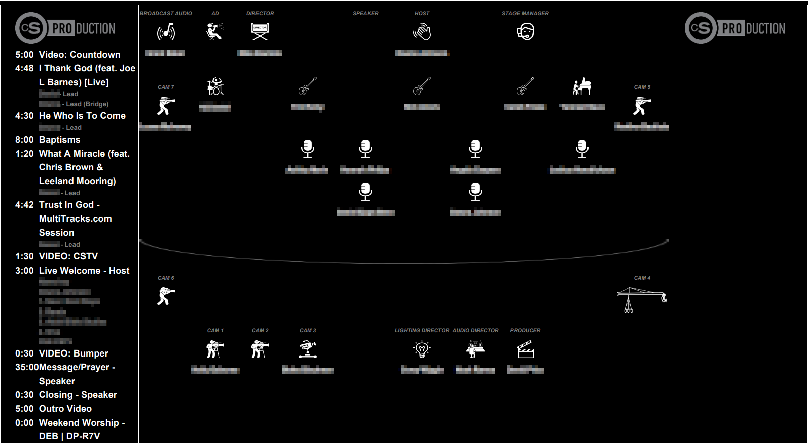

# PCO Custom Report: Production Order & Positions

This custom report provides a comprehensive, high-level view of the Order of Service and team positions. It is designed to be exported as a PDF and displayed on a production room monitor for real-time situational awareness.

---

## 🚀 Overview
At our campus, we display this report on a dedicated TV in the production booth. It allows the entire crew to see the service flow, vocal leads, and physical stage plots at a glance.

> [!IMPORTANT]
> **Not Plug & Play:** This report is heavily dependent on specific Planning Center structures. You will need to modify the code to match your team names, role titles, and image assets.

---

## ✨ Features
* **Dynamic Order of Service:** Lists all items with durations. Includes auto-wrapping to a second column for long services.
* **Vocal & Special Event Tracking:** * Automatically extracts names from song notes containing "Lead" (e.g., *PersonA - Lead*) so camera ops know who to frame.
    * Supports display for Baptisms and Child Dedications.
* **Visual Stage Plot:** * **Top:** Backend/Support roles.
    * **Center:** Band members and on-stage camera positions. These are not position accurate, it just displays all the people on stage.
    * **Bottom:** FOH (Front of House) and off-stage camera operators.

---

## 🛠 Setup & Requirements

### 1. Planning Center Structure
For the report to pull data correctly, ensure your PCO plan follows these conventions:
* **Team Names:** The script looks for "Production Team", "Saturday Production Team", or "Sunday Production Team".
* **Notes:** Vocal leads must be formatted in the notes as `Name - Lead`.
* **Roles:** Ensure your specific role names (e.g., "Camera 1", "LD", "Switcher") match the strings in the code.

### 2. Implementation
1. Create a **New Custom Report** in Planning Center Online.
2. Replace the default editor content with the code provided in this repository.
3. Update the following variables/paths within the code:
    * **Team & Role Names:** Change these to match your specific campus setup.
    * **Asset Paths:** Update image URLs (hosted on a public drive) for logos or icons.
    * **Camera Plot:** Adjust coordinates for camera position locations.

### 3. Printing/Display Settings
To achieve the intended layout:
* **Format:** Web Page or PDF.
* **Page Size:** 11x17 (Tabloid).
* **Margins:** 0.

---

## 📧 Support
If you run into issues or need help tweaking the logic for your church's structure, feel free to reach out:
**Mike Bautista** - [mike08.bautista@gmail.com](mailto:mike08.bautista@gmail.com)
